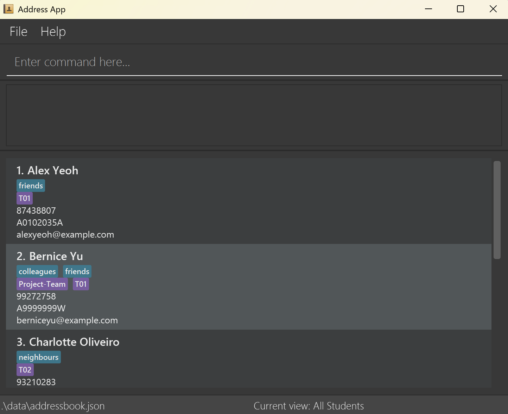
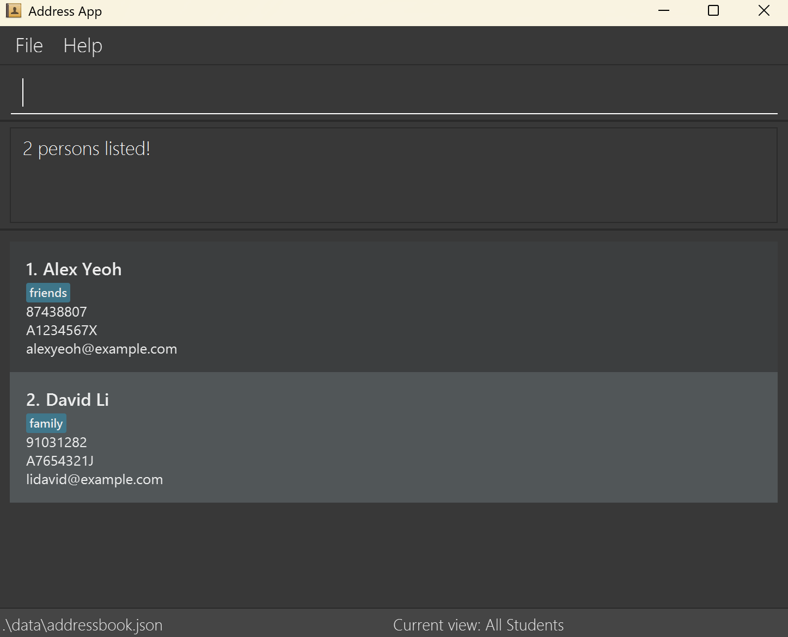

# TAA User Guide

Teacher Assistant's Assistant (TAA) is a **desktop app for Manage all student-related TA matters onto one platform via a Line Interface** (CLI) while still having the benefits of a Graphical User Interface (GUI). If you can type fast, TAA can get your contact management tasks done faster than traditional GUI apps.

<!-- * Table of Contents -->
<page-nav-print />

--------------------------------------------------------------------------------------------------------------------

## Quick start

1. Ensure you have Java `17` or above installed in your Computer. 
   **Mac users:** Ensure you have the precise JDK version prescribed [here](https://se-education.org/guides/tutorials/javaInstallationMac.html).

1. Download the latest `.jar` file from [here](https://github.com/AY2526S2-CS2103T-F14-1/tp/releases/tag/v1.3).

1. Copy the file to the folder you want to use as the _home folder_ for your AddressBook.

1. Open a command terminal, `cd` into the folder you put the jar file in, and use the `java -jar addressbook.jar` command to run the application. 
   A GUI similar to the below should appear in a few seconds. Note how the app contains some sample data. 
   

1. Type the command in the command box and press Enter to execute it. e.g. typing **`help`** and pressing Enter will open the help window. 
   Some example commands you can try:

   * `list` : Lists all contacts.

   * `add n/John Doe p/98765432 e/johnd@example.com m/A1234567X t/friends t/owesMoney` : Adds a contact named `John Doe` to the Address Book.

   * `delete i/3` : Deletes the 3rd contact shown in the current list.

   * `clear` : Deletes all contacts.

   * `exit` : Exits the app.

1. Refer to the [Features](#features) below for details of each command.

--------------------------------------------------------------------------------------------------------------------

## Features

<box type="info" seamless>

**Notes about the command format:** 

* Words in `UPPER_CASE` are the parameters to be supplied by the user. 
  e.g. in `add n/NAME`, `NAME` is a parameter which can be used as `add n/John Doe`.

* Items in square brackets are optional. 
  e.g `n/NAME [t/TAG]` can be used as `n/John Doe t/friend` or as `n/John Doe`.

* Items with `…`​ after them can be used multiple times including zero times. 
  e.g. `[t/TAG]…​` can be used as ` ` (i.e. 0 times), `t/friend`, `t/friend t/family` etc.

* Parameters can be in any order. 
  e.g. if the command specifies `n/NAME p/PHONE`, `p/PHONE n/NAME` is also acceptable.

* Extraneous parameters for commands that do not take in parameters (such as `help`, `list`, `exit` and `clear`) will be ignored. 
  e.g. if the command specifies `help 123`, it will be interpreted as `help`.

* If you are using a PDF version of this document, be careful when copying and pasting commands that span multiple lines as space characters surrounding line-breaks may be omitted when copied over to the application.
</box>

### Viewing help : `help`

Shows a message explaining how to access the help page.

Format: `help`

### Adding a person: `add`

Adds a person to the address book.

Format: `add n/NAME p/PHONE e/EMAIL m/MATRICULATION_NUMBER [t/TAG]…​`

<box type="tip" seamless>

**Tip:** A person can have any number of tags (including 0)
</box>

Examples:
* `add n/John Doe p/98765432 e/johnd@example.com m/A1234567X t/friends t/owesMoney`

### Listing all persons : `list`

Shows a list of all persons in the address book.

Format: `list`

### Editing a person : `edit`

Edits an existing person in the address book.

Format: `edit i/INDEX [n/NAME] [p/PHONE] [e/EMAIL] [m/MATRICULATION_NUMBER] [t/TAG]…​`

* Edits the person at the specified `INDEX`. The index refers to the index number shown in the displayed person list. The index **must be a positive integer** 1, 2, 3, …​
* At least one of the optional fields must be provided.
* Existing values will be updated to the input values.
* When editing tags, the existing tags of the person will be removed i.e adding of tags is not cumulative.
* You can remove all the person’s tags by typing `t/` without
    specifying any tags after it.

Examples:
*  `edit i/1 p/91234567 e/johndoe@example.com` Edits the phone number and email address of the 1st person to be `91234567` and `johndoe@example.com` respectively.
*  `edit i/2 n/Betsy Crower t/` Edits the name of the 2nd person to be `Betsy Crower` and clears all existing tags.

### Locating persons by name: `find`

Finds persons whose names contain any of the given keywords.

Format: `find KEYWORD [MORE_KEYWORDS]`

* The search is case-insensitive. e.g `hans` will match `Hans`
* The order of the keywords does not matter. e.g. `Hans Bo` will match `Bo Hans`
* Only the name is searched.
* Only full words will be matched e.g. `Han` will not match `Hans`
* Persons matching at least one keyword will be returned (i.e. `OR` search).
  e.g. `Hans Bo` will return `Hans Gruber`, `Bo Yang`

Examples:
* `find John` returns `john` and `John Doe`
* `find alex david` returns `Alex Yeoh`, `David Li` 
  

### Deleting a person : `delete`

Deletes the specified person from the address book.

Format: `delete i/INDEX`

* Deletes the person at the specified `INDEX`.
* The index refers to the index number shown in the displayed person list.
* The index **must be a positive integer** 1, 2, 3, …​

Examples:
* `list` followed by `delete i/2` deletes the 2nd person in the address book.
* `find Betsy` followed by `delete i/1` deletes the 1st person in the results of the `find` command.

### Clearing all entries : `clear`

Clears all entries from the address book.

Format: `clear`

### Creating a group : `creategroup`

Adds a tutorial group to the address book.

Format: `creategroup g/GROUP_NAME`

Examples:
*  `creategroup g/T01` Creates the group `T01`

### Deleting a group : `deletegroup`

Deletes a tutorial group from the address book.

Format: `deletegroup g/GROUP_NAME`

Examples:
*  `deletegroup g/T01` Deletes the group `T01`

### Listing all groups : `listgroups`

Shows a list of all groups in the address book.

Format: `listgroups`

### Switching view of groups : `switchgroup`

Switches current view into or out of a group.

Format: `switchgroup g/GROUP_NAME` `switchgroup all`

Examples:
*  `switchgroup g/T01` Switches current view to `T01`
*  `switchgroup all` Switches current view to all students

### Add student to group : `addtogroup`

Adds one or more students to a class space. Students can be identified either by matriculation number or index expression.

Format: `addtogroup g/GROUP_NAME m/MATRIC_NUMBER [m/MATRIC_NUMBER]` `addtogroup g/GROUP_NAME i/INDEX_EXPRESSION [i/INDEX_EXPRESSION]`

For index expressions, supports forms like:
* i/1 
* i/1,2,4 
* i/1-4 
* i/1,3-5

Examples:
*  `addtogroup g/T01 m/A1234567X m/A2345678L` Adds students with matriculation number `A1234567X` and `A2345678L` to group `T01`.
*  `addtogroup g/Project Team i/1,3,5,7` Adds students with the index 1, 3, 5, 7 from the list in the current view to group `Project Team`.

### Remove student from group : `removefromgroup`

Removes one or more students from a group. Students can be identified either by matriculation number or index expression. This only removes the student’s membership from the group, not the student from the address book.

Format: `removefromgroup g/GROUP_NAME m/MATRIC_NUMBER [m/MATRIC_NUMBER]` `removefromgroup g/GROUP_NAME i/INDEX_EXPRESSION [i/INDEX_EXPRESSION]`

For index expressions, supports forms like:
* i/1
* i/1,2,4
* i/1-4
* i/1,3-5

Examples:
*  `removefromgroup g/T01 m/A1234567X m/A2345678L` Removes students with matriculation number `A1234567X` and `A2345678L` from group `T01`.
*  `removefromgroup g/Project Team i/1,3,5,7` Removes students with the index 1, 3, 5, 7 from the list in the current view from group `Project Team`.

### Rename group : `renamegroup`

Changes the name of a group.

Format: `renamegroup g/OLD_GROUP_NAME new/NEW_GROUP_NAME`

Examples:
*  `renamegroup g/T01 new/Tutorial-01` Renames group `T01` to `Tutorial-01`.

### Assign participation to person : `part`

Assigns participation level of a particular date for a tutorial group to person with the index in the list for current view.

Format: `part i/INDEX d/YYYY-MM-DD [g/CLASSSPACE] pv/PARTICIPATION_VALUE`

* The index refers to the index number shown in the list for the current view.
* The index **must be a positive integer** 1, 2, 3, …​
* If group is not given the participation will be assigned for the group in current view.
* PARTICIPATION_VALUE **must be an integer from 0 to 5.**

Examples:
*  `part i/1 d/2026-03-16 g/T02 pv/4` Assigns a participation level of 4 for group T02 on the 16 of March 2026 for the person of index 1 for the list in the current view.

### Mark attendance for person : `mark`

Mark the attendance for a person (with the index of the list in current view) in a group as PRESENT for a particular date.

Format: `mark i/INDEX d/YYYY-MM-DD [g/CLASS_SPACE]`

* The index refers to the index number shown in the list for the current view.
* The index **must be a positive integer** 1, 2, 3, …​
* If group is not given the attendance will be assigned for the group in current view.

Examples:
*  `mark i/1 d/2026-03-16 g/T02` Mark the attendance for group T02 of the person in index 1 of the list in current view as PRESENT for the 16 of March 2026.

### Unmark attendance for person : `unmark`

Mark the attendance for a person (with the index of the list in current view) in a group as ABSENT for a particular date.

Format: `unmark i/INDEX d/YYYY-MM-DD [g/CLASS_SPACE]`

* The index refers to the index number shown in the list for the current view.
* The index **must be a positive integer** 1, 2, 3, …​
* If group is not given the attendance will be assigned for the group in current view.

Examples:
*  `unmark i/1 d/2026-03-16 g/T02` Mark the attendance for group T02 of the person in index 1 of the list in current view as ABSENT for the 16 of March 2026.

### Exiting the program : `exit`

Exits the program.

Format: `exit`

### Saving the data

AddressBook data are saved in the hard disk automatically after any command that changes the data. There is no need to save manually.

### Editing the data file

AddressBook data are saved automatically as a JSON file `[JAR file location]/data/addressbook.json`. Advanced users are welcome to update data directly by editing that data file.

<box type="warning" seamless>

**Caution:**
If your changes to the data file makes its format invalid, AddressBook will discard all data and start with an empty data file at the next run.  Hence, it is recommended to take a backup of the file before editing it. 
Furthermore, certain edits can cause the AddressBook to behave in unexpected ways (e.g., if a value entered is outside the acceptable range). Therefore, edit the data file only if you are confident that you can update it correctly.
</box>

### Archiving data files `[coming in v2.0]`

_Details coming soon ..._

--------------------------------------------------------------------------------------------------------------------

## FAQ

**Q**: How do I transfer my data to another Computer? 
**A**: Install the app in the other computer and overwrite the empty data file it creates with the file that contains the data of your previous AddressBook home folder.

--------------------------------------------------------------------------------------------------------------------

## Known issues

1. **When using multiple screens**, if you move the application to a secondary screen, and later switch to using only the primary screen, the GUI will open off-screen. The remedy is to delete the `preferences.json` file created by the application before running the application again.
2. **If you minimize the Help Window** and then run the `help` command (or use the `Help` menu, or the keyboard shortcut `F1`) again, the original Help Window will remain minimized, and no new Help Window will appear. The remedy is to manually restore the minimized Help Window.

--------------------------------------------------------------------------------------------------------------------

## Command summary

Action     | Format, Examples
-----------|----------------------------------------------------------------------------------------------------------------------------------------------------------------------
**Add**    | add n/NAME p/PHONE e/EMAIL m/MATRICULATION_NUMBER [t/TAG]…   e.g., add n/John Doe p/98765432 e/johnd@example.com m/A1234567X t/friends t/owesMoney
**Add to Group**   | addtogroup g/GROUP_NAME m/MATRIC_NUMBER [m/MATRIC_NUMBER] addtogroup g/GROUP_NAME i/INDEX_EXPRESSION [i/INDEX_EXPRESSION]   e.g., addtogroup g/T01 m/A1234567X m/A2345678L
**Clear**  | clear
**Create Group**   | creategroup g/GROUP_NAME   e.g., creategroup g/T01
**Delete** | delete INDEX  e.g., delete i/3
**Delete Group**   | deletegroup g/GROUP_NAME   e.g., deletegroup g/T01
**Edit**   | edit INDEX [n/NAME] [p/PHONE_NUMBER] [e/EMAIL] [a/ADDRESS] [t/TAG]…  e.g.,edit 2 n/James Lee e/jameslee@example.com
**Exit**   | exit
**Find**   | find KEYWORD [MORE_KEYWORDS]  e.g., find James Jake
**Help**   | help
**List**   | list
**List Groups**   | listgroups
**Mark Attendance**   | mark i/INDEX d/YYYY-MM-DD [g/CLASS_SPACE]   e.g., mark i/1 d/2026-03-16 g/T02
**Participation**   | part i/INDEX d/YYYY-MM-DD [g/CLASSSPACE] pv/PARTICIPATION_VALUE   e.g., part i/1 d/2026-03-16 g/T02 pv/4
**Remove from Group**   | removefromgroup g/GROUP_NAME m/MATRIC_NUMBER [m/MATRIC_NUMBER] removefromgroup g/GROUP_NAME i/INDEX_EXPRESSION [i/INDEX_EXPRESSION]   e.g., removefromgroup g/T01 m/A1234567X m/A2345678L
**Rename Group**   | renamegroup g/OLD_GROUP_NAME new/NEW_GROUP_NAME   e.g., renamegroup g/T01 new/Tutorial-01
**Switch Group**   | switchgroup g/GROUP_NAME switchgroup all   e.g., switchgroup g/T01
**Unmark Attendance**   | unmark i/INDEX d/YYYY-MM-DD [g/CLASS_SPACE]   e.g., unmark i/1 d/2026-03-16 g/T02

